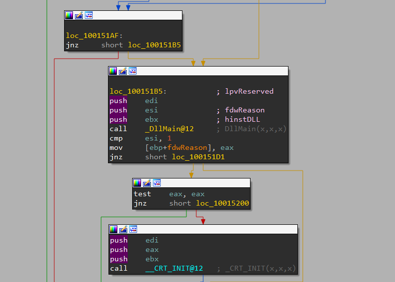
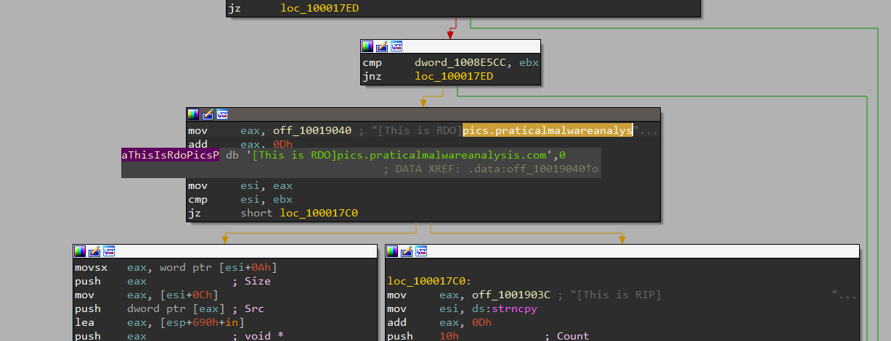
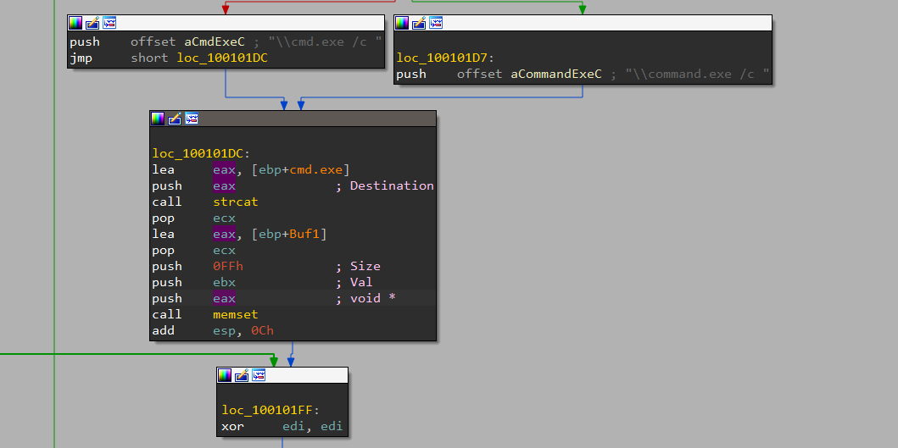
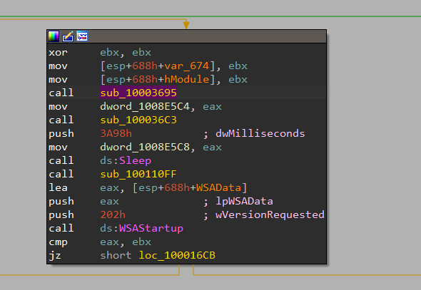
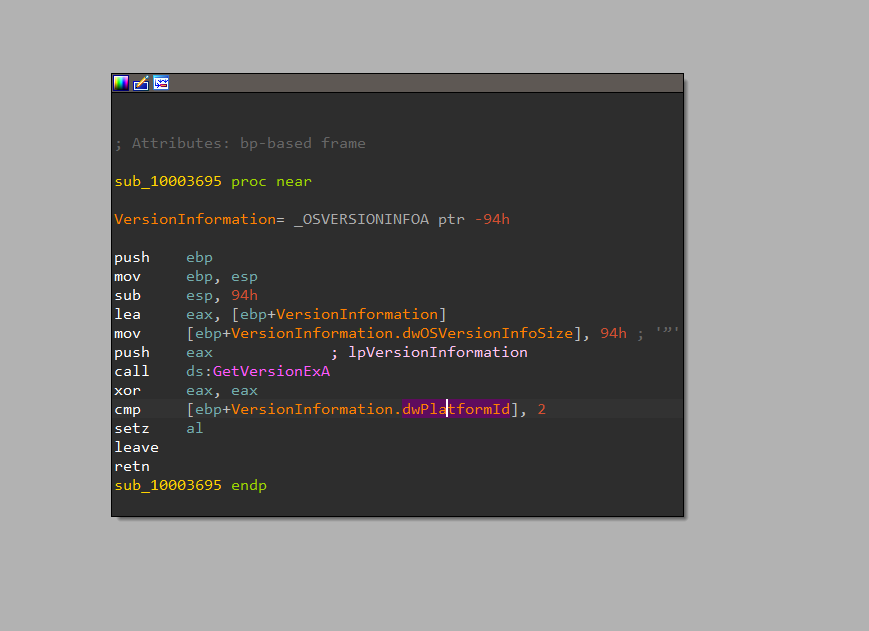
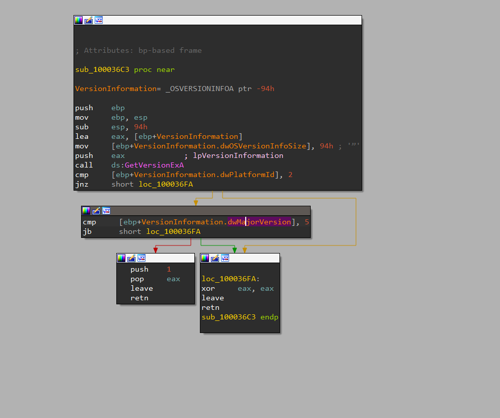
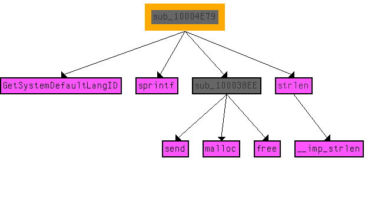

# Introduction
- This readme file contains answers to the questions asked in LAB05. Though the DLL is big and complex, Ive chosen to answer the questions only and analyze it at a later date as currently its not within my grasp. The purpose of this lab is to familiarize oneself with IDA and Assembly.

## Questions
1) What is the address of DLLMain
- We go to the "Exports" tab to find the exported functoins, DLLEntry among them, examining which reveals DLLMain
The function is at 0x1000D02E


2) Use the Imports window to browse to gethostbyname. Where is the import located?
- 0x100163CC, fairly straightforward.

3) How many functions call gethostbyname
- 9.

4) Focusing on the call to gethostbyname located at 0x1000757, can you figure out which DNS request will be made?
- Lets examine the call. We list the xrefs to gethostbyname using "X" and locate the call in question.



- structure of gethostbyname:
https://learn.microsoft.com/en-us/windows/win32/api/winsock2/nf-winsock2-gethostbyname
```
hostent *WSAAPI gethostbyname(
  const char *name
);

typedef struct hostent {
  char  *h_name;
  char  **h_aliases;
  short h_addrtype;
  short h_length;
  char  **h_addr_list;
} HOSTENT, *PHOSTENT, *LPHOSTENT;

```
- This function takes a domain as its argument, and returns the Address associated with the domain, resolved via DNS.
- eax is given the address of the string "[This is RDO]pics.praticalmalwareanalysis.com" and moved forward by 0xDh bytes. This leaves eax pointing to pics.praticalmalwareanalysis.com.
- eax is then pushed onto the stack and gethostbyname is called. Hence pics.praticalmalwareanalysis.com is the domain that will be looked up by gethostbyname

5) How many local variables has IDA Pro recognized for the subroutine at 0x10001656?
- We jump to the given address using "G"
- The answer is 23

6) How many parameters has IDA Pro recognized for the subroutine at 0x10001656?
- One:
`; DWORD __stdcall sub_10001656(LPVOID lpThreadParameter)`

7) Use the Strings window to locate the string "\cmd.exe /c" in the disassembly. Where is it located?
- Go to View -> Open Subview -> Strings or press SHIFT+F12 to open the Strings Window.
- Searching for the string, we find it's located at 0x10095B34

8) What is happening in the area of code that references "\cmd.exe /c"?
- The code copies the string to a local variable, then cleares a memory region using memset.
- Then it calls "recv", hence the code seems to be accepting commands from the attacker, though this assumption is, with the information we have, shaky.


9) In the same area, at 0x100101C8, it looks like dword_1008E5C4 is a global variable that helps decide which path to take. How does the malware set it?
- We jump to the address, then use the XREF feature to find where else dword_1008E5C4 is referenced.
- Here, we see that it contains the value returned from sub_10003695.



### sub_10003695
- This function is fairly simple and calles GetVersionExA, and compares dwPlatformId to 2, and stores the result of the comparison into eax, which is then stored in our global variable.
```
NOT_BUILD_WINDOWS_DEPRECATE BOOL GetVersionExA(
  [in, out] LPOSVERSIONINFOA lpVersionInformation
);
```
```
VER_PLATFORM_WIN32_NT -- 2:
The operating system is Windows 7, Windows Server 2008, Windows Vista, Windows Server 2003, Windows XP, or Windows 2000.
```


- Hence, the function seems to be checking the operating system.

10) A few hundred lines into the subroutine at 0x1000FF58, a series of comparisons use memcmp to compare strings. What happens if the string comparison to robotwork is successful (when memcmp returns 0)?
- Jumping to the address using "G" we find a massive comparison, before which the program seems to be greeting "Master", and if the comparison to "robotwork" is successful, the function "sub_100052A2" is called.

### sub_100052A2
- The program here queries the registry key "SOFTWARE\Microsoft\Windows\CurrentVersion" and returns the value for "WorkTime".


Upon examining the MSDN docs for RegOpenKeyA, we find the peculiar note:
```
Note  This function is provided only for compatibility with 16-bit versions of Windows. Applications should use the RegOpenKeyEx function.
```
This in conjunction with the results of Q9 tells us the malware was developed for Older Versions of Windows.

11) What does the export "PSLIST" do?
- The function first calls sub_100036C3 which checks if the OS version is less than 5, and returns a 0 if it is, and a 1 if it is not.
- This indicates that the function does nothing if the OS version is too low, and something if it is not.



- It then checks if a parameter is supplied, based on the comparison it calls a function.
- Both functions seem to be doing similar things, calling CreateToolhelp32Snapshot at the start and iterating over the values.  Hence it may be assumed that the PSLIST function lists the processes, and if a parameter was supplied, lists any similar processes

12) Use the graph mode to graph the cross-references from sub_10004E79. Which API functions could be called by entering this function? Based on the API functions alone, what could you rename this function?
- The function calls GetSystemDefaultLangID sprintf and strlen, hence it may be renamed "GetSysLang" as it seems to be getting the systems default langauge, and sending it to the master server.



13) How many Windows API functions does DLLMain call directly? How many at a depth of 2?
- We can answer this easily by using the Graph XREF User XREF Chart feature, as the default xref is a complete mess. Set the recursion length to 1 and hit OK.


- At a depth of two the function calls far too many for us to keep track of, but at a depth of 1 it calls CreateThread strnicmp strcpy and strlen.

14) At 0x10001358, there is a call to Sleep (an API function that takes one parameter containing the number of miliseconds to sleep). Looking backward through the code, how long will the program sleep if this code executes?
- Jumping to the given address, we find the program will sleep for \*(eax+13)\*1000 miliseconds, which comes out to 30 seconds.


15) At 0x10001701 is a call to socket. What are the three parameters?
- The structure of the socket function is as follows:
```
SOCKET WSAAPI socket(
  [in] int af,
  [in] int type,
  [in] int protocol
);
```


16) Using the MSDN Page for socket and the named symbolic constant functionality in IDA Pro, can you make the parameters more meaningful? What are the parameters after you apply changes?
- The three parameters are af=2, type=1, protocol=6, which means that the socket will be over IPv4(af=AF_INET), the communication can be two-way (type=SOCK_STREAM), and the protocol will be TCP (protocol=IPPROTO_TCP)

17) Search for usage of the isntruction (opcode 0xED). This instructino is used with a magic string "VMXh" to perform VMware detection. Is that in use in this malware? Using the cross-references to the function that executes the in instructino, is there further evidence of VMware detection?
- Converting VMXh to hex we get 564D5868, which if we search for using IDA we find the following block of code:


- This is confusing to me and I will come back to this later.

18) Jump your cursor to 0x1001D988. What do you find?
- A long, strange string.
### I have omitted the following questions as they require IDA Pro and I only use the freeware version.
19) If you have the IDA Python plug-in installed (included wit hthe commercial version of IDA Pro), run LAB05-01.py an IDA Pro Python script provided with the malware for this book. (Make sure the cursor is at 0x1001D988.) What happens after you run the script?
20) With the cursor in the same location, how do you turn this data into a single ascii string?
21) Oopen the script with a text editor. How does it work?